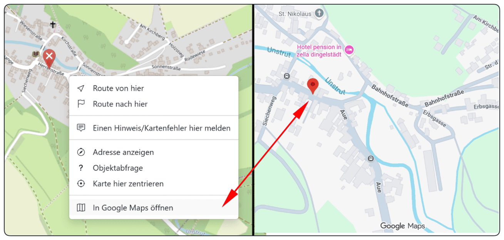

# OSM to Google Maps Button

Diese Version ist für die Chrome-Erweiterung **User JavaScript and CSS** vorbereitet.

## Beschreibung

Dieses Projekt erweitert **OpenStreetMap** um einen zusätzlichen Eintrag im Rechtsklick-Menü der Karte:

- **In Google Maps öffnen**

Damit kann eine Position aus OpenStreetMap direkt in **Google Maps** geöffnet werden, ohne die Koordinaten manuell kopieren zu müssen.

Zusätzlich ergänzt das Skript bei Suchtreffern in OpenStreetMap einen kleinen **Google-Maps-Button**, sofern dort Koordinaten direkt verfügbar sind.

## Beispiel



Im Kontextmenü von OpenStreetMap erscheint der zusätzliche Eintrag **„In Google Maps öffnen“**.  
Damit wird die angeklickte Position direkt in Google Maps geöffnet.

## Erweiterung

**Chrome Web Store:**  
[User JavaScript and CSS](https://chromewebstore.google.com/detail/user-javascript-and-css/nbhcbdghjpllgmfilhnhkllmkecfmpld?pli=1)

## Programmansicht


## Funktionen

- erkennt Rechtsklicks direkt auf der OpenStreetMap-Karte
- übernimmt die Koordinaten der angeklickten Position
- fügt im Karten-Kontextmenü den Eintrag **„In Google Maps öffnen“** hinzu
- öffnet die Position direkt in **Google Maps**
- ergänzt bei OSM-Suchergebnissen zusätzliche **Google-Maps-Buttons**
- arbeitet mit Fallbacks, falls Koordinaten nicht sofort direkt aus dem Karten-Event gelesen werden können

## Geeignet für

- Nutzer, die regelmäßig mit **OpenStreetMap** arbeiten und Positionen schnell in **Google Maps** prüfen möchten
- Vergleich von Kartenansichten zwischen OSM und Google Maps
- schnelle Übergabe einer Kartenposition ohne Copy & Paste
- Arbeiten mit Suchergebnissen und Kartenpunkten in OSM

## Einrichten in der Erweiterung

### 1. Neue Regel anlegen
In **User JavaScript and CSS** eine neue Regel erstellen.

### 2. URL pattern festlegen

```text
https://www.openstreetmap.org/*
```

### 3. JavaScript einfügen
Den Inhalt der Datei **osm-to-google-maps-button.js** in das linke JavaScript-Feld einfügen.

### 4. Optional CSS einfügen
Den Inhalt der Datei **osm-to-google-maps-button.css** in das rechte CSS-Feld einfügen.

### 5. Speichern
Auf **Save** klicken und OpenStreetMap neu laden.

## Funktionsweise

Das Skript reagiert auf Rechtsklicks innerhalb der OpenStreetMap-Karte und versucht dabei, die aktuelle Position zu ermitteln.

Danach wird das OSM-Kontextmenü um folgenden Punkt ergänzt:

- **In Google Maps öffnen**

Beim Anklicken dieses Eintrags wird die ermittelte Position im neuen Tab in **Google Maps** geöffnet.

Zusätzlich prüft das Skript Suchtreffer in OpenStreetMap. Falls dort Breiten- und Längengrad vorhanden sind, wird neben dem Treffer ein zusätzlicher **Google-Maps-Link** eingeblendet.

## Technische Hinweise

- OpenStreetMap verwendet Leaflet
- das Skript nutzt deshalb Karten-Events wie:
  - `contextmenu`
  - `click`
- zusätzlich werden Fallbacks genutzt:
  - Auslesen der Kartenmitte
  - Auslesen der Koordinaten aus der URL
- dynamische Änderungen werden mit `MutationObserver` beobachtet
- doppelte Einträge werden verhindert

## Dateien im Projekt

- **README-OSM-to-Google-Maps.md** – Beschreibung und Einrichtungsanleitung
- **osm-to-google-maps-button.js** – JavaScript für die Erweiterung
- **osm-to-google-maps-button.css** – optionale CSS-Datei
- **osm-to-google-maps-beispiel.png** – Beispielbild
- **programmansicht-user-javascript-and-css.png** – Screenshot der Erweiterung

## Hinweis

Da OpenStreetMap seine Oberfläche künftig ändern kann, kann es sein, dass das Skript bei späteren Layout-Änderungen angepasst werden muss.

## Lizenz

Private oder freie Nutzung nach Bedarf.
